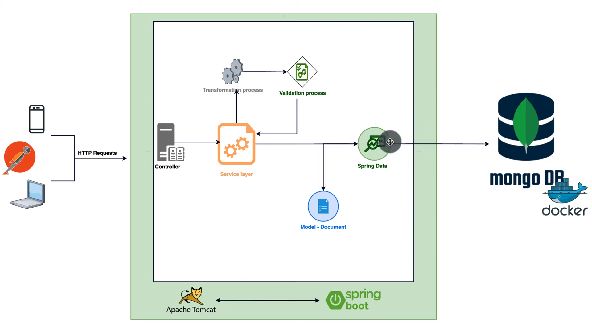

# mongoDB_SpringBoot3_Docker_Project
Project based learning for MongDB ( NoSQL ) with Spring Boot 3 and Docker Integrated 

Project Flow - 



Note - When using mongoDB via Docker and running the Spring application in the local system, then in that point the value of host in the application.yml should not be `localhost` , it should be `host.docker.internal`.

Sample application.yml ( refactored application.properties ) - 
```spring:
  data:
    mongodb:
      username: satyarth
      password: satyarth
      host: host.docker.internal
      port: 27017
      database: mongodbLearning
      authentication-database: admin

